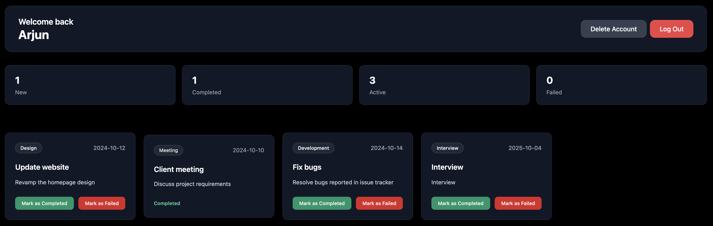
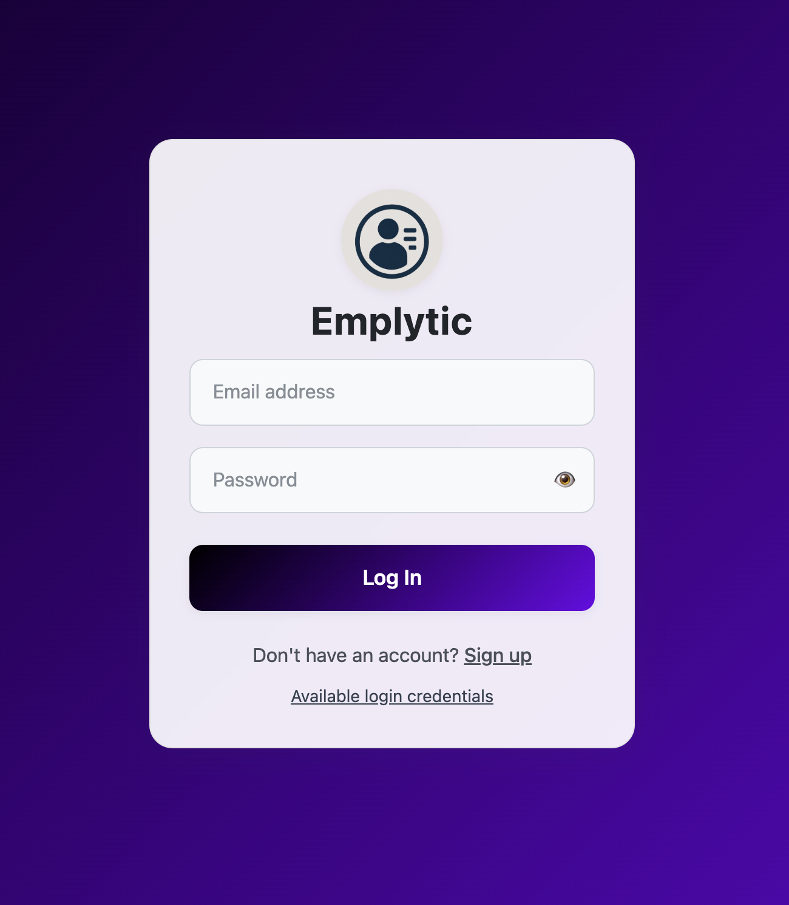

# 👨‍💼 Employee Management System – Emplytic

Emplytic is a **full-stack Employee Management System** built with **React.js, Node.js, and MongoDB**. It allows organizations to efficiently manage employee data, track performance, and maintain records in a centralized, easy-to-use platform.

---

## 🚀 Features
- 📝 Add, update, and delete employee records  
- 📊 View employee details and statistics in a dashboard  
- 🔒 Secure login system for admin access  
- 🌐 Responsive design, works on desktop and mobile  
- ☁️ Deployed online for instant access  

---

## 🛠️ Tech Stack
- **Frontend:** React.js, Tailwind CSS  
- **Backend:** Node.js, Express.js  
- **Database:** MongoDB  
- **Deployment:** Vercel  

---

## ⚙️ How It Works
1. Admin logs in using secure credentials  
2. Add new employees or update existing records  
3. View employee list and detailed profiles  
4. Delete employees when required  
5. All data is stored in MongoDB and served via Express.js API  

---

## 📷 Screenshots
### 🖥️ Dashboard
  

### 📝 Employee Form
  

---

## 🌐 Live Demo
👉 [Emplytic Deployed App](https://emplytic.vercel.app/)  

---

## 📜 Future Improvements
- 📂 Role-based access control (Admin, HR, Employee)  
- 📈 Advanced analytics and performance tracking  
- 🔔 Email notifications for new updates or changes  
- 🧠 Integrate AI for smart insights on employee performance  

---

## 🤝 Contributions
Contributions are welcome! Fork the repo, create a branch, and submit a pull request.
